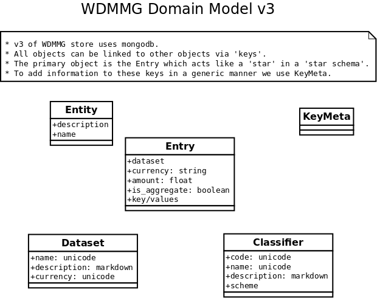

Description of Data Models
==========================

.. py:currentmodule:: wdmmg

This is a brief description of the Data models. It's not necessarily
complete as instances have no fixed schema and can be extended
dynamically. These attributes should be documented through
:class:`wdmmg.model.mongo.KeyMeta`

This is a diagram of the domain model classes available:

   Diagram of the model classes

Entry
-----

An `entry` represents a cash flow and can tell who paid whom how much. 
It has a number of required attributes not listed in the diagram that 
are asserted by the :func:`.lib.loader.Loader.create_entrity` method.
These are:

amount
  float. How much money
currency
  string
is_aggregate
  boolean. Is it a single, isolated entry or an aggregate of many entries?
  fixme: right?
dataset
  string. Set by the a speiallized data loader and can represent one or a 
  part of a ckan datapkg source (or another data source).

Entities
--------
Regionen, Behörden, Firmen, Einzelpersonen
